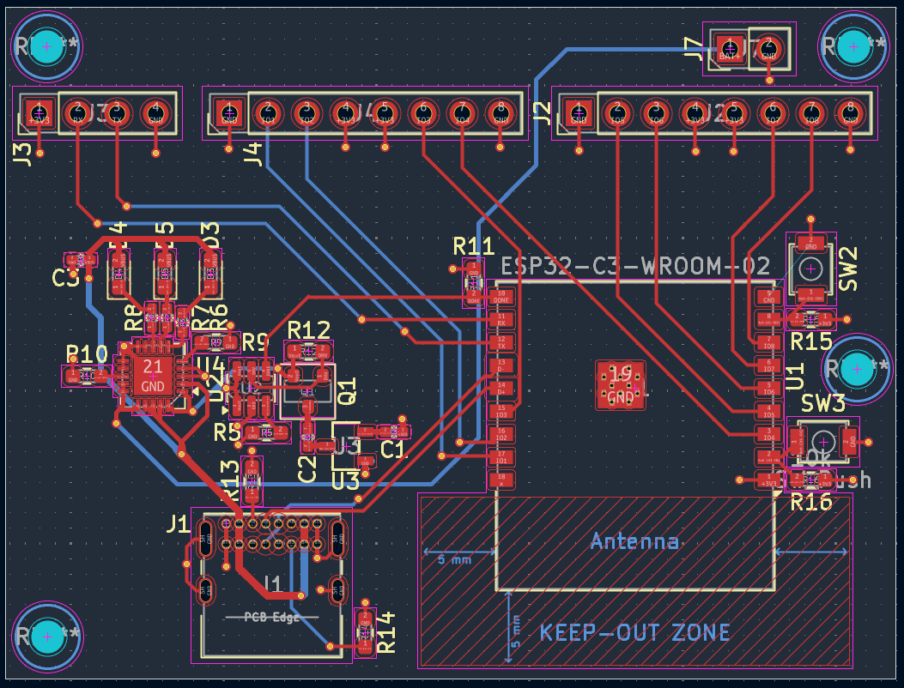
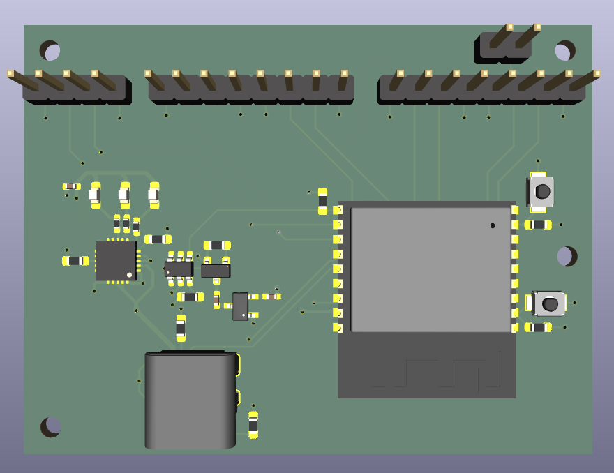
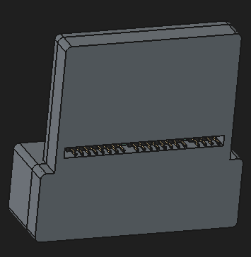
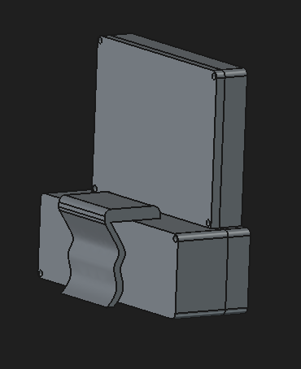

# Harvest-Overseer 🌱
>Built for third space Hack Club! - Week 1️⃣  
_It all started when two unemployed dudes stumbled upon a third, equally unemployed dude. Unburdened by 9-to-5s (erm but we have 9-5s for school) and fuelled by sheer ambition, the trio set off to blaze new trails, conquering land, sea, and hardware. Day and night they grind towards their goal — will they pull it off? Only fate can tell._

A stationary, comprehensive agricultural monitor that measures soil pH, moisture levels, nutrient concentrations (NPK), and light intensity. It displays the data of the plant and soil's health on an LCD screen to let you easily know what your plant needs.

## 💠 Project Overview 💠
**Harvest-Overseer** is an all-in-one agricultural monitor designed to take the guesswork out of plant care. Stationed directly in your garden bed or potted plant, it will continuously track essential environmental and soil parameters — displaying real-time health diagnostics on an integrated LCD screen so you always know exactly what your plants need to thrive.

### Key Features 🗝️
🥖**Soil pH & Nutrients Tracking:** Monitors pH balance and NPK (_Nitrogen, Phosphorus, Potassium_) concentrations.\
💧**Moisture Detection:** Measures active soil hydration levels to prevent over or under-watering.\
☀️**Light Intensity:** Tracks daily ambient light exposures to ensure optimal photosynthesis conditions.\
👁️**One-Glance Display:** Instant visual updates through a 7-pin SPI lcd.\
🔋**Battery Powered:** Fully portable design powered by a rechargeable Li-ion battery with integrated power management.  

## 🍰 PCB & Hardware Architecture 🥯
Harvest-Overseer uses a modular architecture consisting of a central **Master Unit (Main Brain)** for processing and display, and one or more remote **Sensor Node(s)** designed for low-power battery operation.
### Master Unit — The Core 🍎
The Master Unit receives sensor data, handles system logic, and drives the local LCD status display.
+ <ins>The BRAIN</ins>🧠 `ESP32-S3-WROOM-1-N16R8` to handle calculations, sensor input processing, and screen rendering.
+ <ins>The FACE</ins>🥶 14-pin socket (Conn_01x14_Socket) featuring dedicated connections for a `7-Pin SPI lcd` (_GND, VCC, CLK, MOSI, RES, DC, CS_)
+ <ins>The HEART</ins>🫀 An  integrated footprint of `TP4056 charging power module board` for safe USB-C power delivery and Li-ion battery charging, and a `TPS7133Q` (a low dropout voltage regulator) that converts 4.2V to 3.3V for a clean and stable voltage rail for the ESP32-S3 and other sensitive logic pins.

_Master Unit PCB and Schematics_
<table>
  <tr>
    <td align="center">
       
      Schematic
    </td>
    <td align="center">
       
      PCB Trace Routing
    </td>
  </tr>
  <tr>
    <td align="center">
        
      3D PCB Render (Top view)
    </td>
    <td align="center">
       
      3D PCB Render (Bottom view)
    </td>
  </tr>
</table>

### Sensor Node — The Backbone 🐙
The Sensor Node is an autonomous, ultra-low-power unit stationed in the soil bed to read the pH, moisture, light, and NPK levels, transmitting readings wirelessly back to the Core.

#### Components & Silicon 💎
+ <ins>The BRAIN_1</ins> `ESP32-C3-WROOM-02` (compact RISC-V Wi-Fi/BLE MCU) for reading sensors and beaming data to the Main Brain.
+ <ins>Power Management</ins> `MCP73871-2CC`, a LiPo/Li-ion charge manager with automatic power path management, allowing simultaneous solar/USB power supply and battery charging.
+ <ins>A Timer</ins>⏲️ `TPL5110`, a nano-power system timer that completely cuts off power to the entire node until a scheduled wake interval, drastically reducing standby drain to nano-amps for a long-term outdoor work.
+ <ins>Another High-Efficiency Power Management Component</ins>, the `DMG3415U` (P-Channel MOSFET) used to physically power down high-draw soil sensors when the node is sleeping.
+ <ins>Voltage Regulation (LDO)</ins> `HT7333` (Low quiescent current 3.3V regulator for logic and sensor rails).

#### Connectors & Peripherals 🖇️
+ <ins>USB-C Interface</ins>🔋 a `USB4085` GCT 16-pin USB-C receptacle for charging and power delivery.
+ <ins>Sensor Terminal Blocks</ins> `WAGO 233 Series` tool-less spring-cage terminals (2x08 and 2x04) for wiring of soil sensors (pH, NPK, moisture, light).
+ <ins>User Controls</ins>🫳 `B3U-1000P` tactile push button for manual settings, `LED_SMD_0603` status LED for charging state, `68k,10k,2k,100k,5.1k resistor smd 0603 & 470R resistor smd 0402` and `10uF capacitor smd 0402`for signal conditioning, and power rail decoupling.

<table>
  <tr>
    <td align="center">
       
      Schematic
    </td>
  </tr>
</table>
<table>
  <tr>
    <td align="center">
        
      PCB Trace Routing
    </td>
    <td align="center">
       
      3D PCB Render
    </td>
  </tr>
</table>
<table>
  <tr>
    <td align="center">
        
      3D Model
    </td>
    <td align="center">
       
      3D Model
    </td>
  </tr>
</table>

## Display & User Interface 👾
`DLS24035B` for the display (3.5 Inch 480*320 SPI TFT LCD Module with ILI9488 Driver) with a custom case model.
<table>
  <tr>
    <td align="center">
       
      Front View
    </td>
    <td align="center">
       
      Bottom View
    </td>
  </tr>
</table>

_Here's a photo of the Master Unit PCB in the case._
<table>
  <tr>
    <td align="center">
       
      Master Unit 3D PCB in case
    </td>
    <td align="center">
       
      Master Unit 3D PCB model
    </td>
  </tr>
</table>

_Some display ui (done in the Figma software)_
<table>
  <tr>
    <td align="center">
       
      Plant in good helth
    </td>
    <td align="center">
       
      Plant is unhelth
    </td>
  </tr>
</table>

## Components Used
+ ESP32-S3-WROOM-1-N16N
+ 14-pin socket (Conn_01x14_Socket)
+ TP4056 charging power module board
+ TPS7133Q LDO
+ ESP32-C3-WROOM-02
+ MCP73871-2CC
+ TPL5110
+ DMG3415U
+ HT7333_C2684634
+ USB-C receptacle GCT_USB4085
+ Terminal block WAGO_233-508_2x08
+ Terminal block WAGO_233-508_2x04
+ Button switch SW_SPST_B3U-1000P
+ LED_SMD_0603
+ 10µF capacitor SMD 0402
+ 68k, 10k, 2k, 100k, 5.1k resistor SMD 0603
+ 470R resistor SMD 0402
+ DLS24035B (3.5inch 480*320 SPI TFT LCD Module with ILI9488 Driver)

## BOM
| MCU                               | ESP32-C3-WROOM-02                                   | 1   | 1.80  | 1.80  | https://www.aliexpress.com/item/1005003181553659.html                |
| --------------------------------- | --------------------------------------------------- | --- | ----- | ----- | -------------------------------------------------------------------- |
| 2.54mm Female Header              | Conn_01x08_Socket                                   | 2   | 0.15  | 0.75  | https://www.aliexpress.com/w/wholesale-2.54mm-female-header.html     |
| 2.54mm Female Header              | Conn_01x04_Socket                                   | 1   | 0.10  | 0.50  | https://www.aliexpress.com/w/wholesale-2.54mm-female-header.html     |
| 2.54mm Female Header              | Conn_01x02_Socket                                   | 1   | 0.08  | 0.40  | https://www.aliexpress.com/w/wholesale-2.54mm-female-header.html     |
| LiPo/Li-ion Battery Management IC | MCP73871-2CC                                        | 1   | 2.20  | 2.20  | https://www.aliexpress.com/item/1005009931582723.html                |
| Ultra-Low-Power Timer             | TPL5110                                             | 1   | 3.50  | 3.50  | https://www.aliexpress.com/item/1005009324980307.html                |
| P-Channel MOSFET                  | DMG3415U                                            | 1   | 0.09  | 8.50  | https://www.aliexpress.com/item/1005009968198030.html                |
| Low-Power LDO                     | HT7333_C2684634                                     | 1   | 0.10  | 1.00  | https://www.aliexpress.com/item/32697055615.html                     |
| USB-C Receptacle                  | GCT_USB4085                                         | 1   | 0.35  | 1.75  | https://www.aliexpress.com/w/wholesale-16p-usb-c-receptacle.html     |
| Terminal block                    | WAGO_233-508_2x08                                   | 1   | 1.20  | 1.20  | https://www.aliexpress.com/w/wholesale-wago-233.html                 |
| Terminal block                    | WAGO_233-508_2x04                                   | 1   | 0.70  | 0.70  | https://www.aliexpress.com/w/wholesale-wago-233.html                 |
| Button switch                     | SW_SPST_B3U-1000P                                   | 2   | 0.10  | 1.00  | https://www.aliexpress.com/w/wholesale-smd-tactile-switch.html       |
| LED                               | SMD_0603                                            | 3   | 0.01  | 0.80  | https://www.aliexpress.com/w/wholesale-0603-smd-led.html             |
| Ceramic Capacitor SMD             | 10µF 0402                                           | 3   | 0.01  | 0.90  | https://www.aliexpress.com/w/wholesale-0402-10uf.html                |
| Ceramic Resistor SMD              | 68k 0603                                            | 1   | 0.01  | 0.50  | https://www.aliexpress.com/w/wholesale-smd-resistor-sample-book.html |
| Ceramic Resistor SMD              | 10k 0603                                            | 4   | 0.01  | 0.50  | https://www.aliexpress.com/w/wholesale-smd-resistor-sample-book.html |
| Ceramic Resistor SMD              | 2k 0603                                             | 1   | 0.01  | 0.50  | https://www.aliexpress.com/w/wholesale-smd-resistor-sample-book.html |
| Ceramic Resistor SMD              | 100k 0603                                           | 1   | 0.01  | 0.50  | https://www.aliexpress.com/w/wholesale-smd-resistor-sample-book.html |
| Ceramic Resistor SMD              | 5.1k 0603                                           | 2   | 0.01  | 0.50  | https://www.aliexpress.com/w/wholesale-smd-resistor-sample-book.html |
| Ceramic Resistor SMD              | 470R 0402                                           | 3   | 0.01  | 0.50  | https://www.aliexpress.com/w/wholesale-smd-resistor-sample-book.html |
| Liquid Crystal Display            | DLS24035B                                           | 1   | 9.20  | 9.20  | https://www.aliexpress.com/item/1005005287088814.html                |
| Capacitor SMD                     | 1uF 0603 (C_0402_1005Metric)                        | 1   | 2.27  | 2.27  | https://www.aliexpress.com/item/1005012364450156.html                |
| 2.54mm Female Header              | Conn_01x14_Socket (PinSocket_1x14_P2.54mm_Vertical) | 1   | 2.89  | 2.89  | https://www.aliexpress.com/item/1005003610333849.html                |
| Resistor SMD                      | 10k 0603 (R_0603_1608Metric)                        | 3   | 0.45  | 1.36  | https://www.aliexpress.com/item/1005005677654015.html                |
| Push Button Switch (THT)          | MJTP1243 (SW_PUSH_1P1T_6x3.5mm_H4.3_APEM_MJTP1243)  | 1   | 0.42  | 0.42  | https://www.digikey.com/en/products/detail/apem-inc/MJTP1243/1798039 |
| Side Tactile Switch (SMD)         | TS-1101-C-W (SW-SMD_TC-1101V-C-B-W)                 | 1   | 0.40  | 0.40  | https://item.szlcsc.com/300030.html                                  |
| Power Module                      | TP4056 module (PWRM-TH_TP4056)                      | 1   | 1.73  | 1.73  | https://www.aliexpress.com/item/1005005982385924.html                |
| MCU Module                        | ESP32-S3-WROOM-1-N16R8 (ESP32-S3-WROOM-1_EXP)       | 1   | 4.78  | 4.78  | https://www.aliexpress.com/item/1005005230800143.html                |
| Voltage Regulator IC              | TPS7133 (SOIC-8_3.9x4.9mm_P1.27mm)                  | 1   | 15.36 | 15.36 | https://www.aliexpress.com/item/1005012324115212.html                |
